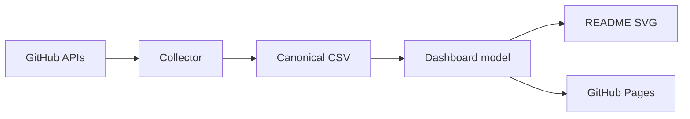
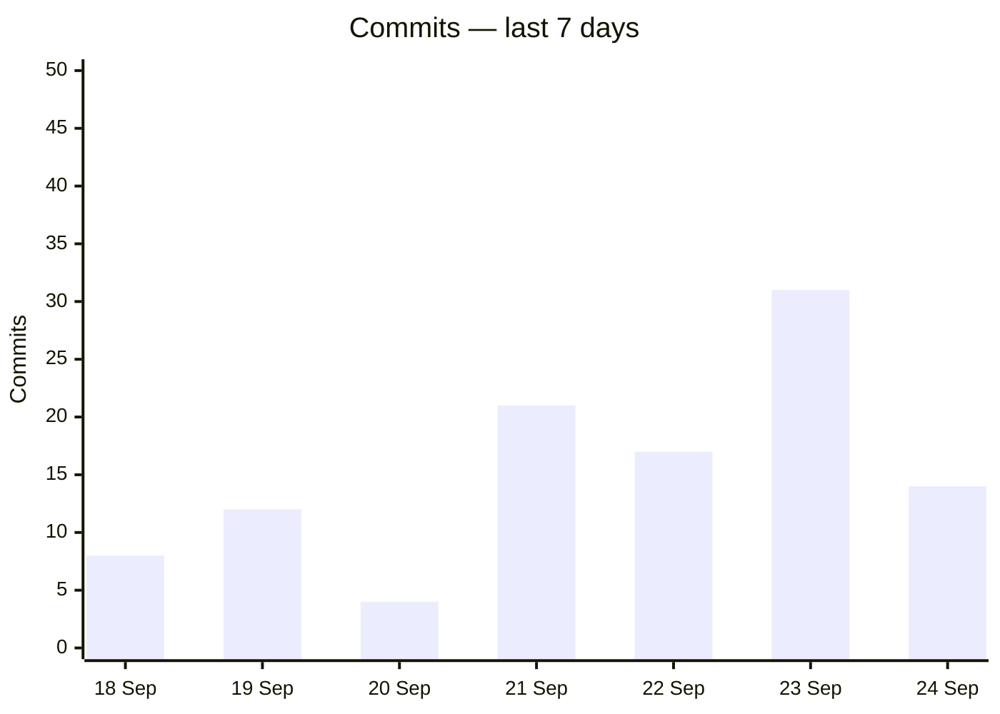
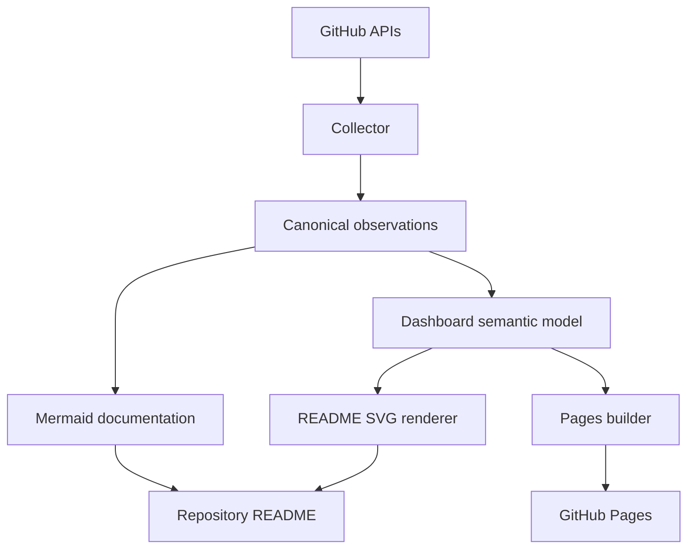

# GitHub Observatory: визуализационная архитектура README-dashboard и GitHub Pages

**Дата:** 2026-09-24  
**Объект:** `ForestTiger-GH/github-observatory`  
**Статус:** Research Result / проектное исследование  
**Предмет:** стандартный набор графиков на главной странице репозитория + отдельный интерактивный GitHub Pages dashboard  
**Изменения текущего Product / collector / schema:** в рамках исследования не выполнялись

---

## 1. Краткий вывод

Для GitHub Observatory оптимальна **двухуровневая визуализационная система**:

```text
Уровень 1 — README
быстрый обзор прямо на главной странице repository

Уровень 2 — GitHub Pages
полноценный интерактивный Observatory
```

Рекомендуемая архитектура:

```text
canonical observations
        ↓
derived dashboard model
        ↓
┌─────────────────────────┬─────────────────────────────┐
│                         │                             │
▼                         ▼                             │
generated SVG             static Pages data/model      │
│                         │                             │
▼                         ▼                             │
README                 JavaScript + ECharts             │
│                         │                             │
└──── summary ────────────┴──── full analysis ─────────┘
```

Главный принцип:

> **README и Pages должны показывать одну и ту же аналитическую реальность, но с разной глубиной.**

README — это портфельная обложка: 4–6 стандартных панелей, дата данных, статус сбора и переходы в подробный интерфейс.

Pages — рабочая аналитическая поверхность: фильтры, периоды, выбор репозиториев, drill-down, compare, tooltips, таблицы, data-quality и ссылки на evidence.

---

## 2. Связь с предыдущими исследованиями

Это исследование развивает три уже сформированных направления:

1. `GitHub_Observatory_Temporal_Semantics_2026-09-24.md` — целевая модель `T / T−1`;
2. `GitHub_Observatory_Dynamic_Rendering_Research_2026-09-24.md` — идея `README + generated SVG + Pages`;
3. `GitHub_Observatory_Daily_Metrics_Research_2026-09-24.md` — расширенный evidence model: `STATE / CHANGE / WORKFLOW / AUTOMATION / DELIVERY / ATTENTION / WORK TYPE / OBSERVATORY HEALTH`.

Важно: temporal semantics пока является Research Result. На изученном baseline текущий collector ещё использует `cutoff_date` как `data_date` для snapshot family. Визуализация должна внедряться после либо вместе с семантическим согласованием дат, иначе красивый интерфейс закрепит неверную временную модель.

---

## 3. Три поверхности одного продукта

Правильнее проектировать не «набор картинок», а три связанных уровня:

```text
SUMMARY
   ↓
EXPLORATION
   ↓
EVIDENCE
```

Пользовательский сценарий:

```text
увидел всплеск на README
→ нажал график
→ Pages открылся уже с нужным view/filter
→ выбрал repository
→ увидел детализацию
→ при необходимости открыл underlying CSV / SCHEMA
```

Это превращает README из документа в входную точку Observatory.

---

## 4. Что GitHub реально позволяет прямо в README

GitHub Markdown поддерживает:

- изображения;
- SVG;
- Mermaid;
- Markdown tables;
- относительные ссылки и image paths;
- `<picture>` для light/dark;
- `<details>/<summary>` для сворачиваемых sections.

При этом GitHub sanitizes HTML и удаляет опасные конструкции, включая `script`, inline styles и ряд произвольных атрибутов.

Следствие:

```text
README ≠ JavaScript application
```

README может быть **static-but-fresh**: Action ежедневно перестраивает изображения, а GitHub показывает их как обычный контент.

---

## 5. Mermaid: что это и где он полезен

Правильное название — **Mermaid**.

GitHub рендерит Mermaid прямо из fenced code block:



Mermaid поддерживает, среди прочего:

- flowchart;
- sequence;
- state;
- class;
- ER;
- git graph;
- pie;
- XY chart.

Для Observatory особенно важны `flowchart`, `pie` и `xychart`.

---

## 6. Mermaid XY Chart

Современный Mermaid имеет `xychart`, который поддерживает line и bar series.

Пример:



То есть Mermaid технически способен быть простым chart renderer.

---

## 7. Почему Mermaid не стоит делать главным renderer аналитики

### 7.1. Версию контролирует GitHub

GitHub рекомендует проверять текущую версию Mermaid через:

```mermaid
info
```

Новая feature в документации Mermaid может появиться раньше, чем соответствующая версия на github.com.

### 7.2. Chart vocabulary ограничен

Observatory нужны:

- stacked composition;
- calendar heatmap;
- ranking bars;
- small multiples;
- quality overlays;
- exact missing-state semantics;
- compact KPI + sparklines;
- более точный layout.

Mermaid здесь быстро становится ограничивающим фактором.

### 7.3. README пришлось бы генерировать ежедневно

Если daily values embedded в Mermaid block, Action должен каждый день изменять сам `README.md`.

Чище:

```text
README stays mostly static
Action updates generated SVG files
```

### 7.4. Visual control

Generated SVG позволяет строго управлять:

- axes;
- ticks;
- labels;
- typography;
- gaps;
- annotations;
- light/dark variants;
- dimensions.

### 7.5. Accessibility

Mermaid поддерживает `accTitle` и `accDescr`, но GitHub отдельно предупреждает, что не все diagram types полностью a11y-compliant.

---

## 8. Где Mermaid использовать стоит

Mermaid отлично подходит для:

- collector architecture;
- data flow;
- snapshot vs flow semantics;
- publication pipeline;
- schema relationships;
- developer documentation;
- research results.

Итоговая роль:

```text
Mermaid = diagram layer
SVG/ECharts = analytical chart layer
```

---

## 9. Распределение форматов

| Surface | Формат | Роль |
|---|---|---|
| README architecture | Mermaid | схемы |
| README metrics | generated SVG | стандартные графики |
| README facts | Markdown | даты, статусы, ссылки |
| README secondary | `<details>` + SVG | доп. панели |
| Pages | HTML/CSS/JS | интерфейс |
| Pages charts | Apache ECharts | интерактивная аналитика |
| Pages data | generated JSON | derived presentation model |
| Evidence | CSV | канонические наблюдения |
| Semantics | Markdown | `SCHEMA.md`, contracts |

---

## 10. Почему generated SVG — базовый формат README-графиков

SVG:

- нативно отображается GitHub;
- векторный;
- хорошо масштабируется;
- text-based;
- Git-friendly;
- детерминируемо генерируется;
- позволяет light/dark variant;
- не требует JS в README;
- может быть полностью self-contained.

GitHub поддерживает `<picture>` с `prefers-color-scheme`, поэтому можно хранить:

```text
activity-light.svg
activity-dark.svg
```

---

## 11. Не один giant SVG, а набор панелей

Лучше:

```text
assets/generated/
├── summary-light.svg
├── summary-dark.svg
├── activity-light.svg
├── activity-dark.svg
├── work-mix-light.svg
├── work-mix-dark.svg
├── repository-focus-light.svg
├── repository-focus-dark.svg
├── attention-light.svg
├── attention-dark.svg
└── automation-light.svg
```

Преимущества:

- один chart = один смысл;
- отдельное тестирование;
- отдельное обновление;
- проще responsive;
- проще deep-link на Pages;
- меньше blast radius при renderer error;
- легко прятать вторичные panels в `<details>`.

---

## 12. README должен быть summary

README должен читаться за 10–20 секунд.

Целевая структура:

```text
# GitHub Observatory

[Open Full Observatory →]

Observed: 24 Sep 2026 UTC
Latest complete day: 23 Sep 2026 UTC
Collection: 26 / 26

[SUMMARY]

## Portfolio activity — 28D
[activity.svg]

## Work composition — 4 weeks
[work-mix.svg]

## Repository focus — 7D
[repository-focus.svg]

## Attention — 28D
[attention.svg]

<details>
<summary>Development & automation</summary>

[development.svg]
[automation.svg]

</details>

SCHEMA · Raw observations · Research
```

---

## 13. Две даты должны быть видны

README и Pages должны одновременно показывать:

```text
Observed: 24 Sep 2026 UTC
Latest complete day: 23 Sep 2026 UTC
```

Это визуально закрепляет:

```text
T   = current state
T−1 = closed daily flows
```

Collection status:

```text
Collection: 26 / 26
Errors: 0
```

При неполном сборе:

```text
Collection: 24 / 26
2 unavailable
```

---

## 14. KPI strip

Рекомендуемые KPI:

```text
Repositories
Active repositories
Commits
Churn
Views
Collection status
```

Каждая карточка должна иметь временную подпись:

```text
Repositories
26
current snapshot

Commits
142
latest complete day
```

Нельзя смешивать T и T−1 как будто они относятся к одному моменту.

---

## 15. Standard chart №1 — Portfolio Activity

Главный chart Observatory.

Период:

```text
28 days
```

Почему 28:

- ровно четыре недели;
- лучше week-over-week;
- достаточно для режима;
- не перегружает README.

Лучше показывать два синхронных small multiples:

```text
COMMITS
CHURN
```

с общей x-axis.

Если реализован actor classification:

```text
human-associated
automation-associated
unknown
```

можно использовать stacked daily bars.

---

## 16. Почему dual-axis лучше не использовать

Плохой вариант:

```text
commits → left axis
churn   → right axis
```

Он может создавать визуальную ложную корреляцию.

Лучше:

```text
two aligned charts
same dates
independent y-scales
```

---

## 17. Standard chart №2 — Work Composition

После появления `work-types` это один из самых полезных charts.

Рекомендуемый вид:

```text
100% stacked weekly bars
```

Категории:

```text
product_code
tests_quality
documentation_specification
research_method
data_content
automation_ci
configuration
unknown
```

Daily composition слишком шумна. Weekly — сильнее.

---

## 18. Почему не pie как основной Work chart

Pie отвечает:

> как распределён один snapshot/period?

Но Observatory важнее показывает:

> как composition меняется?

Поэтому:

```text
pie → secondary
100% weekly stacked bars → primary
```

---

## 19. Unknown должен быть видим

Если classifier покрыл 82%:

```text
unknown = 18%
```

Это отдельный segment.

Нельзя автоматически пересчитать известные 82% к 100%, скрыв неполноту.

---

## 20. Standard chart №3 — Repository Focus

Цель:

> где сейчас сосредоточена работа?

Форма:

```text
horizontal bar ranking
```

Период:

```text
7D
```

Основная measure:

```text
churn
```

Альтернативы на Pages:

```text
commits
changed-file occurrences
PR merges
Actions runs
views
```

README показывает Top 8–10.

---

## 21. Repository Focus: commits vs churn

```text
commits
→ частота commit events

churn
→ объём textual change
```

Это разные измерения.

Поэтому title должен быть конкретным:

```text
Repositories by 7D churn
```

а не:

```text
Top repositories
```

---

## 22. Standard chart №4 — Attention

Основные данные:

```text
views
clones
```

Рекомендуются два синхронных small multiples за 28D.

Дополнительно Pages может показывать:

```text
stars delta
forks delta
unique observations
referrers
paths
```

Но repository-level uniques нельзя выдавать за уникальных людей по всему portfolio.

---

## 23. Standard chart №5 — Development Flow

После PR/Issues layer:

```text
PR opened vs merged
Issues opened vs closed
```

Период:

```text
28D
```

KPI:

```text
Open PR backlog
Open issue backlog
PR merge time p50
Issue close time p50
```

Quantiles лучше раскрывать на Pages, а README оставить компактным.

---

## 24. Standard chart №6 — Actions Health

Рекомендуемый вид:

```text
daily stacked runs
success / failure / cancelled
```

Период:

```text
28D
```

Дополнительно:

```text
Failure rate 7D
Runtime p50
Queue p50
Rerun rate
```

Если source не реализован — panel отсутствует. Не рисовать фальшивые нули.

---

## 25. Delivery

Для deployable repositories:

```text
Releases
Deployments
```

На README — secondary/collapsed panel.

На Pages — полноценный view.

Если production semantics нет:

```text
Unsupported / unavailable
```

а не `0`.

---

## 26. Observatory Health

Отдельная trust surface.

README:

```text
collection status
```

Pages:

```text
run duration
repository completeness
source completeness
retries
rate limits
classification coverage
```

---

## 27. Activity Calendar Heatmap

Отличный Pages chart.

Metric selector:

```text
commits
churn
views
Actions
PR merges
```

Он хорошо показывает:

- bursts;
- streaks;
- gaps;
- weekly cadence;
- смену режимов.

ECharts имеет готовую calendar heatmap модель.

---

## 28. Small multiples по repositories

Один chart с 26 линиями почти нечитаем.

Лучше:

```text
one mini-chart per repository
```

с одинаковой semantics.

Sorting:

```text
latest value
28D total
name
role
```

---

## 29. Compare mode

Выбор:

```text
2–6 repositories
```

Modes:

```text
Absolute
Share of portfolio
Indexed = 100 at period start
```

Indexed mode особенно полезен для stock metrics:

```text
files
size
stars
```

---

## 30. README charts должны вести в exact Pages view

Пример:

```text
activity.svg
→ ?view=activity&period=28d
```

```text
repository-focus.svg
→ ?view=repositories&period=7d&metric=churn
```

```text
attention.svg
→ ?view=attention&period=28d
```

README становится навигационной картой.

---

## 31. Deep links

Все важные analytical states должны быть URL-representable:

```text
?view=activity&period=28d
```

```text
?view=repo&repo=1375017353&period=90d
```

```text
?view=compare&repos=1375017353,1341646865&metric=churn
```

В URL использовать `repository_id`, потому что имя может измениться.

---

## 32. Query routing лучше path routing на первом этапе

GitHub Pages — static hosting.

Вместо:

```text
/repo/tabularium/activity
```

проще:

```text
/?view=repo&repo=...
```

Плюсы:

- direct refresh;
- no SPA 404 tricks;
- no router dependency;
- простые deep links.

---

## 33. Основная навигация Pages

Предлагаемые views:

```text
Overview
Activity
Work
Development
Automation
Delivery
Attention
Data Quality
```

Repository drill-down — mode поверх них.

---

## 34. Overview Page

Повторяет README по смыслу, но добавляет:

- interactive hover;
- periods;
- filters;
- click-through;
- larger history;
- data-quality details.

---

## 35. Activity Page

Filters:

```text
period
repositories
repository roles
human/automation
```

Charts:

```text
commits
additions
deletions
churn
changed-file occurrences
active repositories
activity calendar
```

---

## 36. Work Page

Filters:

```text
period
repository
repository role
work type
actor class
```

Charts:

```text
work composition
work type over time
repo × work-type matrix
classification coverage
```

Ключевая matrix:

```text
                    code   tests   docs   research   data   automation
software_product
method_spec
data_registry
research_pilot
...
```

---

## 37. Development Page

Charts:

```text
PR opened / merged / closed
PR backlog
PR cycle-time distribution
Issue opened / closed
Issue backlog
Issue age buckets
```

---

## 38. Automation Page

Charts:

```text
workflow runs
success/failure/cancel
runtime
queue time
reruns
Actions usage
cache storage
artifact storage
```

---

## 39. Delivery Page

Charts:

```text
releases
deployments
deployment status
release cadence
change lead time
```

DORA-like metrics отображать только при формально подтверждённой semantics.

---

## 40. Attention Page

Charts:

```text
views
clones
star deltas
fork deltas
top referrers
popular paths
```

`referrers/paths` — rolling snapshot, их нельзя рисовать как обычный daily flow.

---

## 41. Data Quality Page

Показывать:

```text
latest run
run duration
repositories seen
repositories successful
source completeness
unavailable families
rate-limit state
retries
classification coverage
```

Ключевой вопрос:

> пусто потому, что было 0, или потому, что данные недоступны?

---

## 42. Global filters

Top filter bar:

```text
Period
Repositories
Repository roles
Visibility
Actor class
Work type
```

Controls, которые не применимы к текущему view, скрываются или disabled.

---

## 43. Period presets

Рекомендуемый набор:

```text
7D
28D
90D
YTD
ALL
CUSTOM
```

README:

```text
7D / 28D
```

Pages default:

```text
28D
```

---

## 44. Filter state должен жить в URL

Например:

```text
?view=work&period=28d&role=method_spec&type=research_method
```

Плюсы:

- share;
- bookmark;
- back/forward;
- README deep links;
- reproducible analytical state.

---

## 45. Presentation preferences

В `localStorage` можно хранить:

```text
theme
table density
sidebar state
preferred display mode
```

Analytical filters лучше держать в URL.

---

## 46. Pages не должен читать десятки CSV напрямую

Правильный путь:

```text
CSV evidence
      ↓
Python derived build
      ↓
JSON dashboard model
      ↓
Pages
```

Это сохраняет semantic calculations в тестируемом build layer.

---

## 47. Предлагаемая data structure

```text
dashboard-data/
├── manifest.json
├── summary.json
├── dimensions/
│   ├── repositories.json
│   ├── repository-roles.json
│   └── work-types.json
├── portfolio/
│   ├── activity.json
│   ├── development.json
│   ├── automation.json
│   ├── delivery.json
│   ├── attention.json
│   └── quality.json
└── repositories/
    ├── 1375017353/
    │   ├── activity.json
    │   ├── development.json
    │   └── ...
    └── ...
```

---

## 48. `manifest.json`

Пример:

```json
{
  "schema_version": "1",
  "build_id": "...",
  "generated_at": "...",
  "observation_date_utc": "...",
  "latest_complete_day_utc": "...",
  "repository_count": 26,
  "feature_flags": {
    "work_types": true,
    "pull_requests": true,
    "actions": true,
    "deployments": false
  }
}
```

Pages сначала читает manifest.

---

## 49. Feature flags

Observatory будет развиваться поэтапно.

UI должен знать:

```text
Actions = available
Work types = experimental
Deployments = unavailable
```

Отсутствие data file нельзя трактовать как нулевую активность.

---

## 50. Stable IDs

Cross-file joins:

```text
repository_id
```

Display:

```text
repository name
```

Это делает rename безопасным.


## 51. Missing semantics

В JSON:

```text
null = unknown / unavailable
0    = known zero
```

В chart:

```text
known zero
→ mark at zero

unknown
→ gap / unavailable state
```

По умолчанию line не должна соединяться через unknown.

---

## 52. Flow / stock / rolling snapshot

UI должен явно различать.

### Flow

```text
commits
views
PR merges
Actions runs
```

Основной display:

```text
bar / line by day
```

### Stock

```text
files
stars
open issues
cache bytes
```

Display:

```text
step line / snapshot value
```

### Rolling snapshot

```text
referrers
popular paths
```

Display:

```text
snapshot ranking
```

а не daily temporal flow.

---

## 53. Никакого скрытого smoothing

Default:

```text
raw daily observations
```

Optional toggle:

```text
7D moving average
```

Legend должна прямо показывать, что линия сглажена.

---

## 54. Никакой интерполяции пропущенных данных

Если source unavailable:

```text
gap
```

Если событий точно не было:

```text
0
```

Это один из центральных contracts Observatory.

---

## 55. Axis policy

Bar charts:

```text
y-min = 0
```

Line charts могут иметь non-zero y-min, если это улучшает чтение малых изменений, но scale должна быть очевидной.

README лучше использовать максимально консервативную scale.

Log scale:

```text
только user opt-in
```

---

## 56. Цвета — устойчивый словарь

Work types должны иметь постоянный mapping.

Например:

```text
product_code
tests_quality
documentation_specification
research_method
data_content
automation_ci
configuration
unknown
```

Одинаковая категория всегда получает одно и то же визуальное обозначение во всех charts.

Отдельный словарь:

```text
human
automation
unknown actor
```

Не смешивать две семантические оси.

---

## 57. Не полагаться только на цвет

Использовать дополнительные distinctions:

- marker;
- dash;
- pattern;
- label;
- ordering.

Особенно:

```text
success
failure
cancelled
```

---

## 58. Pie / donut

Использовать только для:

```text
few categories
one period
part-to-whole
```

Observatory в основном temporal, поэтому главные charts:

```text
line
bar
stacked bar
heatmap
small multiples
```

---

## 59. Scatter

Pages может иметь exploratory view:

```text
x = 28D churn
y = 28D views
point = repository
```

Это descriptive relationship.

UI не должен превращать correlation в causal statement.

---

## 60. Repository roles

Полезные aggregation groups:

```text
software_product
library_framework
data_registry
analytics_workspace
method_specification
research_pilot
infrastructure
gateway_integration
archive_legacy
other
```

Role и work type — разные измерения.

---

# 61. Выбор frontend chart library

Рассмотрены:

```text
Mermaid
Chart.js
uPlot
Vega-Lite
Observable Plot
Apache ECharts
```

---

## 62. Mermaid

Сильные стороны:

- GitHub-native;
- zero frontend dependency для Markdown;
- excellent diagrams;
- простые line/bar/pie.

Слабые:

- ограниченная аналитическая выразительность;
- runtime version контролирует GitHub;
- нет полноценного dashboard interaction;
- неудобен для масштабного filter/drill-down UI.

Роль:

```text
documentation diagrams
```

---

## 63. Chart.js

Сильные стороны:

- простой;
- mature;
- line/bar/pie/scatter;
- hover/tooltips;
- data decimation.

Слабые:

- calendar heatmap и richer dashboard forms требуют дополнительных решений;
- interactive dashboard state в основном custom;
- Canvas-first.

Роль:

```text
хороший minimal dashboard engine
```

---

## 64. uPlot

Сильные:

- малый размер;
- очень быстрый;
- excellent time series;
- zoom;
- cursor sync;
- missing data.

Слабые:

- intentionally narrow;
- нет native stacked series;
- слабее для work composition / calendar / matrix;
- data processing полностью внешний.

Роль:

```text
идеален, если продукт почти весь состоит из time-series
```

Для Observatory набор visual forms шире.

---

## 65. Observable Plot

Сильные:

- clean declarative model;
- хорошие transforms;
- pointer/tip/crosshair;
- удобен для exploratory charts.

Слабые:

- полноценный zoom/filter dashboard experience менее цельный;
- application state остаётся внешним.

---

## 66. Vega-Lite

Сильные:

- declarative JSON grammar;
- filters;
- point/interval selections;
- input binding;
- zoom/translate;
- reproducible visual specs;
- strong separation data → encoding.

Слабые:

- runtime stack тяжелее;
- specs могут становиться сложными;
- общий application state всё равно нужен.

Роль:

> лучший кандидат, если основная цель — формальные декларативные visualization specifications.

---

## 67. Apache ECharts

Сильные:

- line;
- bar;
- stacked;
- scatter;
- pie;
- heatmap;
- calendar;
- matrix;
- data zoom;
- click/drill-down events;
- dataset;
- filter/sort transforms;
- dark mode;
- SVG и Canvas renderer;
- tree-shakable imports.

Слабые:

- зависимость крупнее;
- option objects требуют дисциплины;
- metric semantics всё равно должны жить вне charts.

---

## 68. Итоговый выбор

Для Pages наиболее цельный вариант:

```text
Apache ECharts
```

Причина:

> один движок закрывает почти весь ожидаемый visual vocabulary Observatory и даёт достаточную интерактивность без сборки собственного chart framework.

Vega-Lite — сильная future alternative, если проект решит формализовать chart specifications как отдельный декларативный слой.

---

## 69. Frontend stack

Первая версия:

```text
HTML
CSS
ES modules / небольшой JS
Apache ECharts
generated JSON
```

Без React/Vue/Svelte.

Framework стоит вводить только при реальном росте:

- десятки компонентов;
- сложный state graph;
- plugin architecture;
- client-side editing.

---

## 70. Bundling

Предпочтительно:

```text
package.json
package-lock.json
npm ci
tree-shaken production build
Pages artifact
```

Не обязательно commit-ить minified third-party bundle.

Плюсы:

- pinned versions;
- reproducibility;
- меньше source noise;
- self-contained deployment.

---

## 71. Не делать CDN единственной runtime dependency

CDN проще, но тогда dashboard зависит от внешнего availability.

Сильнее:

```text
GitHub Action
→ npm ci
→ bundle
→ deploy self-contained artifact
```

---

## 72. GitHub Pages

GitHub Pages подходит идеально, потому что Observatory нужен static site.

GitHub официально поддерживает custom workflows через:

```text
actions/configure-pages
actions/upload-pages-artifact
actions/deploy-pages
```

Deploy требует как минимум:

```text
pages: write
id-token: write
```

и environment `github-pages`.

---

## 73. Отсутствие server-side runtime — правильная boundary

GitHub Pages не запускает Python/PHP/Ruby server-side.

Для Observatory это полезно:

```text
private authenticated API work
→ GitHub Actions

public interaction
→ static Pages
```

---

## 74. Никаких токенов в браузере

Нельзя:

```text
Pages JS
→ OBSERVATORY_TOKEN
→ GitHub API
```

Правильно:

```text
Action
→ GitHub API
→ aggregated safe JSON
→ Pages
```

---

## 75. Publicness

`github-observatory` сейчас public.

Pages artifact нужно считать публичным.

В него нельзя случайно вынести transient-only detail:

- file paths;
- actor identities;
- PR/issue text;
- workflow logs;
- artifact content;
- security findings.

---

# 76. Build architecture

```text
COLLECT
│
├─ query GitHub
├─ validate
├─ write canonical observations
└─ commit evidence
     │
     ▼
DERIVE
│
├─ read observations
├─ compute dashboard model
└─ validate model
     │
     ├─────────────┐
     ▼             ▼
RENDER README   BUILD PAGES
│             │
├─ SVG light  ├─ HTML/CSS/JS
├─ SVG dark   ├─ ECharts bundle
└─ commit     └─ JSON
                  │
                  ▼
              deploy Pages
```

---

## 77. Evidence commit раньше presentation

Если SVG renderer или Pages build сломался, daily observations всё равно должны быть сохранены.

Это важная fault-domain boundary:

```text
evidence failure
≠
presentation failure
```

---

## 78. Workflows

### Вариант A

Один workflow:

```text
collect
→ commit
→ derive
→ render
→ deploy
```

### Вариант B

Разделить:

```text
collect.yml
visualize.yml
```

с `workflow_run`.

По мере роста системы вариант B сильнее:

- collection проще;
- rendering можно rerun отдельно;
- Pages failure не влияет на evidence.

---

## 79. Не полагаться на push от `GITHUB_TOKEN` как trigger

GitHub специально предотвращает часть рекурсивных workflow chain событий, созданных стандартным `GITHUB_TOKEN`.

Поэтому chaining нужно проектировать явно:

```text
same workflow
workflow_run
reusable workflow
```

---

## 80. Dashboard builder — единственный semantic owner

Плохо:

```text
render_readme.py
сам считает rolling metrics

Pages app
считает их по-другому
```

Хорошо:

```text
build_dashboard_model.py
считает semantics один раз

README renderer
Pages
только consume
```

---

## 81. Same semantic model, not same renderer

Не нужно насильно добиваться одного renderer.

Нормально:

```text
Python-generated SVG
+
ECharts in Pages
```

если они читают один и тот же dashboard model.

Это важнее визуальной implementation symmetry.

---

## 82. Deterministic SVG

Одинаковый input должен давать одинаковый SVG.

Избегать:

- random IDs;
- случайного element order;
- лишних generation timestamps;
- нестабильного float formatting.

Это улучшает Git diff и tests.

---

## 83. SVG dimensions

Удобная единая logical width:

```text
1200
```

Например:

```text
summary:  1200 × 220
chart:    1200 × 420
ranking:  1200 × 520
```

С `viewBox`.

---

## 84. Typography

Использовать common system sans-serif.

Не встраивать font binaries.

Не полагаться на редкий installed font.

README charts должны оставаться читаемыми на mobile.

---

## 85. Light / dark

README:

```text
chart-light.svg
chart-dark.svg
```

через `<picture>`.

Pages:

```text
System
Light
Dark
```

ECharts 6 поддерживает runtime theme switching.

---

## 86. Responsive Pages

Desktop:

```text
sidebar + 2-column dashboard
```

Mobile:

```text
one column
filters drawer
compact header
```

README panels должны быть single-column-friendly.

---

## 87. Tooltips

Каждый tooltip:

```text
Date
Metric
Value
Repository/filter context
Coverage/status when relevant
```

Пример:

```text
23 Sep 2026 UTC
Commits: 31
Active repositories: 8
Coverage: 26/26
```

---

## 88. Source links

Major view должен иметь:

```text
Metric definition
Open source data
```

Это укрепляет evidence orientation.

---

## 89. Chart/Table toggle

Для каждого major Pages chart:

```text
Chart | Table
```

Плюсы:

- exact values;
- accessibility;
- copy/paste;
- debugging;
- auditability.

---

## 90. Export

Можно добавить:

```text
Download filtered CSV
```

полностью client-side.

Это secondary feature, но полезная.

---

## 91. Searchable repository selector

Поиск:

```text
name
description
role
```

Multi-select.

---

## 92. Repository drill-down

Header:

```text
name
description
visibility
role
archived state
freshness
```

Sections:

```text
Activity
Work
Development
Automation
Delivery
Attention
State
```

---

## 93. Repository timeline

Долгосрочно можно добавить фактические annotations:

```text
release published
archive state changed
new language detected
governance changed
```

Не генерировать speculative narrative вроде:

```text
major breakthrough
refactor completed
```

без evidence.

---

## 94. Progressive disclosure

Pattern:

```text
Overview
→ detail
→ advanced
→ evidence
```

Не показывать 30 metrics одновременно.

---

## 95. Performance

26 repositories — небольшой объём.

Но не стоит строить:

```text
one giant JSON forever
```

Первый экран грузит:

```text
manifest
summary
portfolio activity
```

Repository detail — lazy.

---

## 96. Historical chunking

Пока история мала — единый file допустим.

Позже:

```text
activity-2026.json
activity-2027.json
```

или monthly chunks.

Не вводить chunking преждевременно.

---

## 97. Asset hashing

Pages bundle:

```text
app.<hash>.js
style.<hash>.css
```

Это хорошо решает browser caching.

---

## 98. Schema version

Manifest:

```text
schema_version
build_id
```

Frontend должен fail clearly при incompatible version.

---

## 99. Quality badges

Можно показывать:

```text
Complete
Partial
Unavailable
Experimental
```

Например:

```text
Work classification: 84% coverage
```

---

## 100. Experimental metrics

Маркировать:

- DORA proxies;
- work classification;
- actor classification;
- новые partially validated aggregates.

---


## 101. Data-model tests

Обязательные проверки:

```text
null != 0
no future daily flows
dates monotonic
repository IDs valid
portfolio additive totals reconcile
shares sum to expected total
feature_flags correspond to generated files
latest_complete_day < observation_date
```

---

## 102. SVG tests

Golden/snapshot tests:

```text
known fixture
→ expected SVG
```

Проверять:

- `NaN` отсутствует;
- viewBox валиден;
- labels не выходят за bounds;
- unknown создаёт gap;
- known zero отображается;
- bars начинаются от zero;
- light/dark оба рендерятся.

---

## 103. Pages smoke tests

Минимум:

```text
index loads
manifest loads
overview renders
period filter works
repository filter works
URL updates
deep link restores state
null displays unavailable
chart/table toggle works
```

Browser automation можно добавить после стабилизации MVP.

---

## 104. Accessibility

README:

- meaningful `alt`;
- nearby title;
- SVG `<title>` и `<desc>`;
- textual status summary;
- source link.

Pages:

- native HTML controls;
- keyboard navigation;
- visible focus;
- chart/table toggle;
- достаточный contrast;
- color-independent distinctions;
- `prefers-reduced-motion`;
- screen-reader summaries.

---

## 105. Animation

По умолчанию минимальная.

Observatory — аналитический инструмент, animation не должна мешать сопоставлению.

При `prefers-reduced-motion` — отключение.

---

## 106. Loading/error states

Нужно различать:

```text
Loading
No observations
Known zero
Unavailable
Collection error
Unsupported metric
```

Пустой chart не должен быть универсальным ответом.

---

## 107. Freshness

Pages header:

```text
Data observed: 24 Sep 2026 06:55 UTC
Latest complete day: 23 Sep 2026 UTC
Visualization build: 24 Sep 2026 07:00 UTC
```

Это три разных timestamp semantics.

README достаточно первых двух и статуса collection.

---

## 108. Build provenance

В manifest полезно хранить:

```text
source_commit_sha
```

Это позволяет восстановить exact Observatory state, из которого построен Pages artifact.

---

## 109. Chart titles

Title должен отвечать:

```text
что?
какая единица?
какой период?
```

Хорошо:

```text
Portfolio commits — 28D
```

Слабо:

```text
Activity
```

---

## 110. Subtitles

Полезны короткие context lines:

```text
Latest complete day: 23 Sep 2026 UTC
8 of 26 repositories active
```

---

## 111. No opaque ranking

Нельзя писать:

```text
Best repositories
Top projects
```

если metric — просто activity.

Нужно:

```text
Repositories by 7D churn
Repositories by 28D views
```

---

## 112. Concentration

Pages может показывать:

```text
Top-1 share
Top-3 share
HHI
```

README достаточно простого:

```text
Top-3 share
```

HHI — advanced metric, для которого нужна definition.

---

## 113. Work breadth

Repository activity:

```text
active repositories
active roles
active work types
```

Это complementary measure к churn.

---

## 114. Weekly regime

Work view может иметь table:

```text
Week
Code %
Research %
Data %
Automation %
Unknown %
```

Это помогает видеть смену типа работы без дополнительных chart gimmicks.

---

## 115. Current-data MVP

Пока новые metric families ещё не реализованы, README можно построить уже на текущих данных:

```text
Commits — 28D
Changed-file occurrences — 28D
Active repositories — 28D
Repositories by 7D activity
Views / Clones — 28D
Files / repository size snapshots
Collection health
```

---

## 116. Нельзя подменять Work Mix языками

```text
language composition
≠
work composition
```

До появления path-based classifier Work Mix panel лучше скрыть.

Language composition можно оставить отдельным State view.

---

## 117. Language view

Pages:

```text
language composition by repository
language share over snapshots
```

Форма:

```text
stacked bars
```

Это state/composition, а не activity.

---

## 118. Size / file growth

Stock metrics:

```text
files
size_kb
canonical commits
```

Показывать как snapshot trend после выравнивания temporal semantics.

---

## 119. Public/private boundary

Текущий Observatory намеренно хранит high-level observations для repositories независимо от visibility.

Pages должна сохранять тот же approved high-level boundary.

Нельзя расширять private repositories дополнительной детализацией только потому, что frontend это умеет.

---

## 120. Referrers / paths

Их visual contract:

```text
rolling snapshot observed on date T
```

Не:

```text
daily traffic source
```

Подходящие charts:

```text
Top referrers
Top paths
Concentration
```

---

## 121. Local filtering

После загрузки небольшого JSON:

```text
filter
sort
rerender
update URL
```

должны выполняться без нового network request.

Это делает UI быстрым.

---

## 122. Click drill-down

ECharts event model позволяет:

```text
click bar
→ repository filter
→ repository view
```

или:

```text
click work segment
→ Work view filtered by type
```

Очень естественная navigation model.

---

## 123. Trusted chart config

ECharts security guidance отдельно обращает внимание на untrusted configurations, включая regex filters.

Observatory не нужен произвольный query language.

Пользователь должен выбирать только typed controls:

```text
select
multiselect
date range
toggle
metric enum
```

---

## 124. README renderer не обязан использовать ECharts

README SVG лучше рендерить controlled Python code.

Pages — ECharts.

Это уменьшает зависимость README generation от browser/runtime и сохраняет dependency-light core.

---

## 125. Mermaid version probe

Если Mermaid используется в документации с новыми syntax features, перед внедрением стоит проверить:

```mermaid
info
```

и зафиксировать tested behavior.

---

## 126. Mermaid source generation

Отдельные `.mmd` files GitHub умеет рендерить при открытии.

Но README не поддерживает простой механизм:

```text
include external .mmd here
```

как rendered inline diagram.

Поэтому generated daily Mermaid обычно означает generated README block.

Это ещё один аргумент за SVG для metrics.

---

## 127. Generated README markers

Если позже потребуется автогенерация части README:

```text
<!-- OBSERVATORY:BEGIN -->
...
<!-- OBSERVATORY:END -->
```

Action заменяет только этот диапазон.

Но основной layout лучше оставить manually owned.

---

## 128. Full Observatory link

В README должна быть явная ссылка:

```text
Open Full Observatory →
```

И charts сами могут быть links.

Текстовая ссылка всё равно нужна для accessibility.

---

## 129. Project Pages base path

Ожидаемый адрес:

```text
https://foresttiger-gh.github.io/github-observatory/
```

Frontend должен учитывать `/github-observatory/`.

Плохой fetch:

```js
fetch('/dashboard-data/manifest.json')
```

может уйти в domain root.

Надёжнее:

```js
fetch('./dashboard-data/manifest.json')
```

или build-configured base URL.

---

## 130. Visual Contract

Имеет смысл создать отдельный owner:

```text
dashboard/VISUAL_CONTRACT.md
```

Он определяет:

- chart IDs;
- names;
- metric definitions;
- default periods;
- aggregation;
- top-N;
- missing/zero semantics;
- visual vocabulary;
- deep links;
- accessibility;
- versioning.

Это превращает dashboard из набора картинок в спецификацию.

---

## 131. Chart registry

При росте системы:

```json
{
  "portfolio_activity": {
    "default_period": "28d",
    "metrics": ["commits", "churn"],
    "readme": true,
    "pages_view": "activity"
  }
}
```

Это optional next step, не обязательный MVP.

---

## 132. Frontend не должен владеть сложными metrics

Browser может:

```text
filter
sort
simple sum
format
```

Но сложные metrics лучше готовить build-time:

- unique bounds;
- DORA/proxies;
- work classification;
- coverage;
- histograms;
- rolling-window semantics.

---

## 133. Quantiles

Если Pages должен корректно пересчитать p50/p90 при arbitrary repository filters, repository-level p50 недостаточно.

Нужны:

- event-level rows;
- histogram buckets;
- mergeable sketch.

Для compact Observatory лучше:

```text
histogram buckets
```

Они additive.

---

## 134. Duration buckets

PR/Issues:

```text
<1h
1–6h
6–24h
1–3d
3–7d
7–30d
30d+
```

Actions runtime:

```text
<30s
30s–2m
2–5m
5–15m
15–30m
30–60m
60m+
```

Pages может строить distributions без хранения individual objects.

---

## 135. Period comparison

Toggle:

```text
Compare previous period
```

Для 28D:

```text
latest 28D
vs
previous 28D
```

Вывод:

```text
absolute delta
percent delta
```

При предыдущем значении 0 процентное изменение:

```text
undefined
```

а не `∞`.

---

## 136. Stocks vs flows в comparison

Stock:

```text
files
stars
size
```

сравнивать:

```text
end vs start
```

Flow:

```text
commits
views
```

сравнивать:

```text
period total vs previous-period total
```

---

## 137. Cumulative charts

Не использовать как default.

Cumulative series часто визуально растёт всегда и скрывает regime changes.

Default:

```text
daily
```

Cumulative:

```text
optional
```

---

## 138. Archived repositories

По умолчанию исключать из current active ranking.

Но historical series сохраняются.

Filter:

```text
Include archived
```

---

## 139. New repositories

До `first_seen`:

```text
not observed
```

а не:

```text
0 activity
```

Это принципиально.

---

## 140. Missing/disappeared repositories

`present_on_last_scan=false`:

- history остаётся;
- current status показывается;
- repository не исчезает из прошлого.

---

## 141. Repository rename

Join по ID сохраняет continuity.

Latest name — display.

---

## 142. SVG security

Generated SVG должен использовать controlled primitive set:

```text
svg
g
rect
line
path
circle
text
title
desc
```

Без:

```text
script
foreignObject
external references
```

---

## 143. SVG accessibility

Каждый файл:

```xml
<title>...</title>
<desc>...</desc>
```

README image:

```text
meaningful alt
```

Exact values доступны в Pages/table.

---

## 144. SVG diff quality

Для clean Git history:

- stable element order;
- rounded coordinates;
- stable formatting;
- no random IDs;
- no unnecessary timestamps.

---

## 145. Data labels

Не подписывать каждую daily точку.

Подписывать:

- latest point;
- bars в ranking;
- KPI;
- anomaly annotation, если она factual.

Tooltip решает exact-value problem на Pages.

---

## 146. README render failure

Если render сломан:

- предыдущие valid SVG остаются;
- evidence уже сохранён;
- next successful run обновит presentation.

Чтобы stale visualization была заметна:

```text
Data through ...
Visualization generated ...
```

---

## 147. Pages deploy failure

Старый сайт остаётся опубликованным.

Collection evidence не должно зависеть от Pages deploy.

---

## 148. Manual rebuild

Visualization workflow полезно иметь с:

```text
workflow_dispatch
```

для:

- rerender;
- design fix;
- model rebuild;
- Pages repair;

без повторного GitHub API collection.

---

## 149. Development preview

PR/build workflow может:

- build site;
- validate;
- upload artifact;

без production deploy.

Это достаточно для первой стадии.

---

## 150. Source tree proposal

```text
github-observatory/
│
├── README.md
├── SCHEMA.md
├── ForestTiger-GH/
│
├── dashboard/
│   ├── VISUAL_CONTRACT.md
│   └── site/
│       ├── index.html
│       ├── src/
│       │   ├── app.js
│       │   ├── state.js
│       │   ├── data.js
│       │   ├── charts.js
│       │   └── style.css
│       ├── package.json
│       └── package-lock.json
│
├── assets/
│   └── generated/
│       ├── summary-light.svg
│       ├── summary-dark.svg
│       ├── activity-light.svg
│       ├── activity-dark.svg
│       └── ...
│
└── scripts/
    ├── build_dashboard_model.py
    └── render_readme_charts.py
```

Это target concept, а не обязательная мгновенная структура.

---

## 151. Что commit-ить, а что build-only

### Commit

```text
canonical CSV
README SVG
compact reusable derived model — если он нужен другим consumers
```

### Pages artifact only

```text
bundled JS/CSS
expanded presentation JSON
static HTML
```

Так source repository остаётся чище.

---

## 152. Derived model может стать static API

Поэтому сразу полезно иметь:

```text
schema_version
stable repository IDs
documented null semantics
```

Будущие внешние consumers смогут использовать те же JSON.

---

## 153. Build ID

README SVG и Pages manifest должны иметь общий:

```text
build_id
```

Это удобно для debugging.

---

## 154. Recommended README primary set

Если выбрать ровно пять visual blocks:

```text
1. Portfolio Activity — 28D
2. Work Composition — 4 weeks
3. Repository Focus — 7D
4. Attention — 28D
5. Development & Automation — collapsed
```

Плюс:

```text
status strip
Full Observatory link
```

---

## 155. README v1 на сегодняшнем evidence

Поскольку work/PR/Actions ещё не current Product:

```text
1. Commits — 28D
2. Changed-file occurrences — 28D
3. Active repositories — 28D
4. Repositories by 7D activity
5. Views / Clones — 28D
6. Collection status
```

Это можно сделать без ожидания следующей schema epoch.

---

## 156. README v2

После расширения collector:

```text
Work Mix
PR/Issues
Actions Health
```

---

## 157. README v3

После delivery semantics:

```text
Releases
Deployments
Lead-time where valid
```

---

## 158. Implementation sequence

```text
1. Согласовать T/T−1 в Product.
2. Определить dashboard semantic model.
3. Сделать build_dashboard_model.py.
4. Отрисовать один activity SVG.
5. Вставить в README.
6. Добавить repository focus и attention.
7. Добавить light/dark.
8. Создать minimal Pages shell.
9. Подключить manifest + JSON.
10. Реализовать Overview.
11. Добавить period/repository filters.
12. Перенести state в URL.
13. Добавить repository drill-down.
14. Подключать новые metric families по мере появления evidence.
```

---

## 159. Strong negative outcome: Mermaid-only dashboard

Вариант:

> весь Observatory внутри README через Mermaid

технически возможен только для упрощённой версии.

Как target architecture он слабее из-за:

- GitHub-controlled version;
- limited charts;
- no real filters;
- no drill-down;
- daily generated README;
- less visual control;
- weaker handling of quality/missing semantics.

Итог:

```text
Mermaid-only
→ не использовать как primary analytics architecture
```

---

## 160. Strong positive outcome: shared semantic model

Самый важный архитектурный вывод:

```text
не один renderer
а один semantic model
```

То есть:

```text
CSV evidence
    ↓
dashboard model
    ↓
README SVG
Pages ECharts
tables
future static API
```

---

## 161. Целевая архитектура



---

## 162. Итоговая продуктовая модель

### README

```text
current status
+
latest complete-day summary
+
4–5 standard charts
+
deep links
```

Renderer:

```text
generated SVG
```

Mermaid:

```text
architecture / explanatory diagrams
```

### GitHub Pages

```text
filters
periods
repositories
roles
work types
interactive charts
tooltips
drill-down
compare
tables
source links
data quality
```

Frontend:

```text
small static application
+
Apache ECharts
```

Backend:

```text
none
```

Authenticated GitHub access:

```text
Actions only
```

---

# 163. Официальные и первичные источники

## GitHub Markdown / README

1. GitHub Docs — Creating diagrams  
   https://docs.github.com/en/get-started/writing-on-github/working-with-advanced-formatting/creating-diagrams

2. GitHub Docs — Working with non-code files  
   https://docs.github.com/en/repositories/working-with-files/using-files/working-with-non-code-files

3. GitHub Docs — About READMEs  
   https://docs.github.com/en/repositories/managing-your-repositorys-settings-and-features/customizing-your-repository/about-readmes

4. GitHub Docs — Basic writing and formatting syntax  
   https://docs.github.com/en/get-started/writing-on-github/getting-started-with-writing-and-formatting-on-github/basic-writing-and-formatting-syntax

5. GitHub Docs — Collapsed sections  
   https://docs.github.com/en/get-started/writing-on-github/working-with-advanced-formatting/organizing-information-with-collapsed-sections

6. GitHub Markup — rendering and sanitization pipeline  
   https://github.com/github/markup

## Mermaid

7. Mermaid — XY Chart  
   https://mermaid.js.org/syntax/xyChart.html

8. Mermaid — Pie Chart  
   https://mermaid.js.org/syntax/pie

9. Mermaid — Accessibility  
   https://mermaid.js.org/config/accessibility

## GitHub Pages

10. GitHub Docs — Creating a GitHub Pages site  
    https://docs.github.com/en/pages/getting-started-with-github-pages/creating-a-github-pages-site

11. GitHub Docs — Using custom workflows with GitHub Pages  
    https://docs.github.com/en/pages/getting-started-with-github-pages/using-custom-workflows-with-github-pages

12. GitHub Docs — Configuring a publishing source  
    https://docs.github.com/en/pages/getting-started-with-github-pages/configuring-a-publishing-source-for-your-github-pages-site

13. GitHub Docs — About GitHub Pages and Jekyll  
    https://docs.github.com/en/pages/setting-up-a-github-pages-site-with-jekyll/about-github-pages-and-jekyll

## Apache ECharts

14. Apache ECharts — Dataset  
    https://echarts.apache.org/handbook/en/concepts/dataset/

15. Apache ECharts — Data Transform  
    https://echarts.apache.org/handbook/en/concepts/data-transform/

16. Apache ECharts — Events and Actions  
    https://echarts.apache.org/handbook/en/concepts/event/

17. Apache ECharts — Import / tree shaking / renderers  
    https://echarts.apache.org/handbook/en/basics/import/

18. Apache ECharts 6 — dark mode and new features  
    https://echarts.apache.org/handbook/en/basics/release-note/v6-feature/

19. Apache ECharts — Security Guidelines  
    https://echarts.apache.org/handbook/en/best-practices/security/

## Alternative visualization engines

20. Chart.js — Interactions  
    https://www.chartjs.org/docs/latest/configuration/interactions.html

21. Chart.js — Data Decimation  
    https://www.chartjs.org/docs/latest/configuration/decimation.html

22. uPlot  
    https://github.com/leeoniya/uPlot

23. Vega-Lite — Selection Parameters  
    https://vega.github.io/vega-lite/docs/selection.html

24. Vega-Lite — Filter Transform  
    https://vega.github.io/vega-lite/docs/filter.html

25. Vega-Lite — Parameters  
    https://vega.github.io/vega-lite/docs/parameter.html

26. Observable Plot — Transforms  
    https://observablehq.com/plot/features/transforms

---

# 164. Финальный вывод

Целевая система должна работать так:

```text
OBSERVE
→ PRESERVE
→ DERIVE
→ SUMMARIZE
→ EXPLORE
→ TRACE TO EVIDENCE
```

При этом сохраняются исходные принципы Observatory:

```text
evidence first
missing != zero
no hidden inference
no unnecessary sensitive detail
no opaque quality ranking
reproducible visualization
```

Именно сочетание:

```text
README = instant portfolio summary
GitHub Pages = full interactive observatory
Mermaid = explanatory diagrams
SVG = stable README charts
ECharts = Pages analytics engine
```

выглядит наиболее устойчивой и масштабируемой архитектурой следующего этапа.
